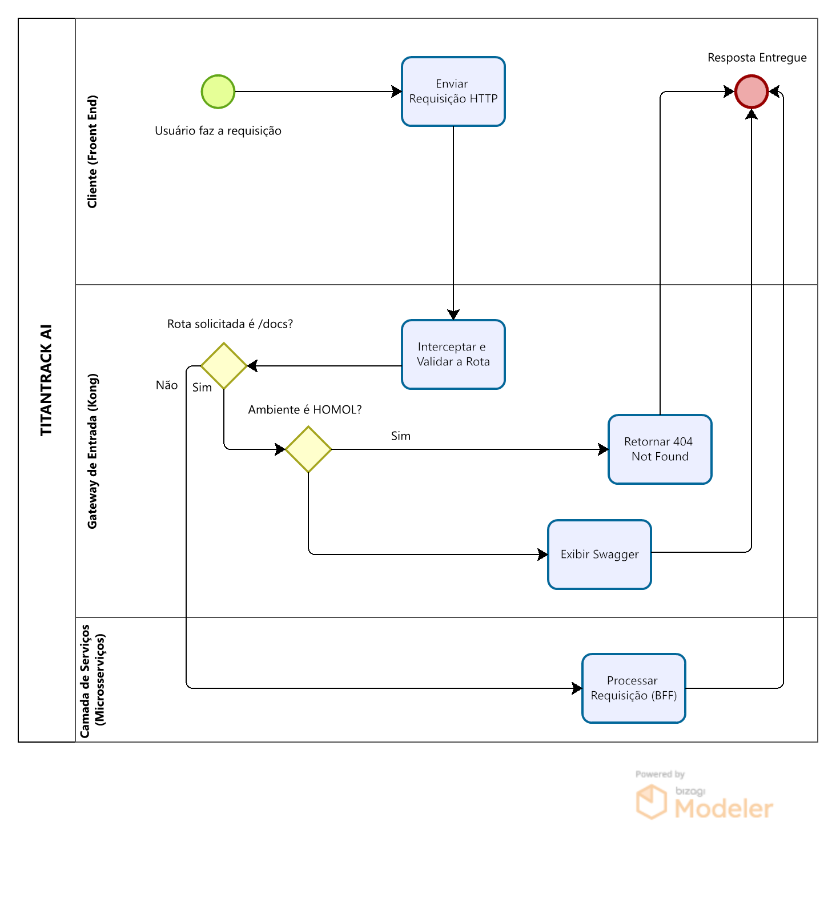

# 🐾 TitanTrack AI — Barramento de Serviços e Arquitetura Global de Microsserviços

Bem-vindo à documentação central do **TitanTrack AI**! Este repositório concentra a especificação arquitetural, os barramentos de roteamento lógico de APIs e os manuais operacionais do ecossistema. O projeto foi integralmente projetado sob um ecossistema **Multirrepo de Microsserviços**, implementando esteiras modernas de Integração e Entrega Contínua (CI/CD) e Observabilidade centralizada na nuvem. Vale-se pontuar que o sistema propriamente originou-se a partir de um auxílio à profissionais relacionados à engenharia do corpo (personais, nutricionistas, ademais).

---

## 🏗️ Evolução da Arquitetura: Monolito ➡️ Microsserviços

A refatoração e migração do antigo modelo monolítico local para uma infraestrutura distribuída em nuvem teve como objetivos fundamentais:
* **Desacoplamento de Domínios:** Ciclos de desenvolvimento, testes e entrega completamente independentes entre a camada de Gateway e as regras de negócio.
* **Escalabilidade Isolada:** Capacidade de escalar serviços críticos de forma independente no provedor de nuvem, reduzindo custos e otimizando recursos.
* **Segurança Perimetral e Isolamento:** Barramento centralizado de segurança (Reverse Proxy) focado em mitigar o vazamento de credenciais e o mapeamento malicioso de rotas internas.

---

## 🗺️ Diagrama de Processo Global (BPMN)

O fluxo operacional e o ciclo de vida de uma requisição HTTP dentro do ecossistema **TitanTrack AI** são controlados dinamicamente pelas políticas de ambiente do Gateway. A modelagem abaixo, desenvolvida no *Bizagi Modeler*, detalha as raias de responsabilidade e a árvore de decisão perimetral:

### 📌 Análise de Caminhos Lógicos do Diagrama:
* **Fluxo Padrão (Business as Usual):** O usuário faz a requisição através do *Cliente (Front-End)* ➔ O *Gateway de Entrada (Kong)* intercepta o tráfego ➔ A rota solicitada **não** é `/docs` ➔ A requisição é tunelada para a *Camada de Serviços (Microsserviços)* ➔ O **BFF realiza o processamento** e devolve o evento final para o encerramento do ciclo com a *Resposta Entregue*.
* **Desvio Condicional de Segurança (Isolamento de Documentação):** Se a rota solicitada for a raiz de documentação interativa (`/docs`), o Gateway avalia o escopo do ambiente ativo:
  * **Se Ambiente for HOMOL (Sim):** O fluxo é retido imediatamente na camada perimetral de rede, acionando o componente de segurança para **Retornar 404 Not Found**, encerrando a conexão sem onerar os microsserviços internos.
  * **Se Ambiente for DEV (Não/Outro):** O Gateway valida o acesso, avança para a etapa de **Exibir Swagger** e encerra o fluxo com sucesso para consumo dos desenvolvedores.

---

## 🗂️ Inventário de Repositórios e Serviços

O ecossistema TitanTrack é composto por repositórios independentes que operam de forma isolada e integrada:

### 1. `titantrack-kong` (Camada de Infraestrutura)
* **Papel:** Centralização de roteamento lógico e ativação de políticas de rede via Kong Gateway em modo declarativo DB-less (`kong.yml`).
* **Hospedagem Render:** * Desenvolvimento (DEV): `https://titantrack-kong-dev.onrender.com`
  * Homologação (HOMOL): `https://titantrack-kong-homol.onrender.com`

### 2. `titantrack-bff` (Camada de Core Application)
* **Papel:** Microsserviço responsável pela inteligência de negócio, persistência, controle de alunos e autenticação.
* **Tecnologias:** Python, FastAPI.
* **Hospedagem Render:**
  * Desenvolvimento (DEV): `https://titantrack-bfff-dev.onrender.com`
  * Homologação (HOMOL): `https://titantrack-bfff-homol.onrender.com`

---

## 🚀 Análise Técnica de CI/CD (Integração e Entrega Contínua)

Toda a esteira de entrega de código é governada pelo **GitHub Actions**, disparando automações a partir das ramificações do fluxo de Git Flow.

[Push / Pull Request] ➔ [Análise de Qualidade] ➔ [Isolamento de Branch] ➔ [Deploy Reativo Cloud]

### 1. Continuous Integration (CI) e Quality Gate
* **Gatilho:** Qualquer push ou abertura de Pull Request direcionado às branches `develop` ou `master`.
* **Métricas de Qualidade (SonarCloud):** Integração profunda com o painel do SonarCloud. A esteira realiza varredura estática completa (SAST), garantindo pontuação máxima (**Nota A**) nos quesitos de *Security*, *Reliability* e *Maintainability*. 

> 💡 **Nota de Infraestrutura:** O status geral do Quality Gate em arquivos puramente configurativos e declarativos com menos de 20 linhas consta nativamente como `Not computed` pela plataforma Sonar para prevenir falsos negativos, mantendo as checagens e notas de segurança válidas e aprovadas.

### 2. Continuous Deployment (CD) e Isolamento de Ambientes
O deploy é desacoplado e reativo. Conforme a branch de origem, as regras de negócio de segurança mudam estritamente:

* **Ambiente de Desenvolvimento (Branch `develop`):** Realiza o deploy para a nuvem de DEV. O arquivo `kong.yml` aponta para o BFF de desenvolvimento e mantém a documentação interativa do **Swagger Habilitada** em `/api/docs` para consumo ágil da equipe.
* **Ambiente de Homologação (Branch `master`):** Realiza o deploy para o ambiente de homologação estável. Para segurança e conformidade, as rotas do Swagger são **Desabilitadas**, retornando `404 Not Found`.

---

## 📊 Arquitetura de Observabilidade Centralizada

Para monitorar o tráfego e o motor assíncrono do Gateway sem onerar o consumo de disco local na nuvem, desenhamos uma estratégia de telemetria baseada em *Push Memory* via **Grafana Cloud**:

1. **Exposição via Prometheus:** O plugin nativo do Prometheus foi acoplado ao barramento interno do Kong, expondo contadores reais no endpoint isolado `/api/metrics`.
2. **Data Source Infinity (Grafana Cloud):** O dashboard consome os dados em tempo real utilizando o conector *Infinity* operando com Frontend Parser. Essa abordagem contorna proxies corporativos e restrições de rede.
3. **Mapeamento de Concorrência:** O painel monitora a saúde interna do motor assíncrono através das métricas de timers:
   * `timers.running`: Quantidade de tarefas executadas simultaneamente em segundo plano pelas políticas do gateway.
   * `timers.pending`: Fila de espera de processos aguardando alocação de CPU.

---

## 🧪 Roteiro de Validação End-to-End (E2E)

As requisições de teste e validação de arquitetura podem ser disparadas contra o Gateway de homologação (`https://titantrack-kong-homol.onrender.com`):

### 1. Teste de Rota de Negócio e Conectividade do BFF
* **Método:** `POST` / `GET`
* **URL:** `https://titantrack-kong-homol.onrender.com/api/auth`
* **Resposta Esperada:** Status `200 OK` ou retorno JSON estruturado vinda do FastAPI (`{"detail":"Not Found"}`), provando que o Kong interceptou a requisição e estabeleceu o túnel com o back-end com sucesso.

### 2. Teste de Bloqueio do Swagger (Segurança de Homologação)
* **Método:** `GET`
* **URL:** `https://titantrack-kong-homol.onrender.com/api/docs`
* **Resposta Esperada:** Status `404 Not Found` controlado (`{"detail":"Not Found"}`), evidenciando que a documentação foi devidamente isolada e protegida contra varreduras externas no ambiente de homologação.

### 3. Coleta de Telemetria (Métricas do Gateway)
* **Método:** `GET`
* **URL:** `https://titantrack-kong-homol.onrender.com/api/metrics`
* **Resposta Esperada:** Dump de metadados do barramento contendo o status de concorrência (`"pending": X, "running": Y`), indicando que o Prometheus está coletando a performance interna do ecossistema.